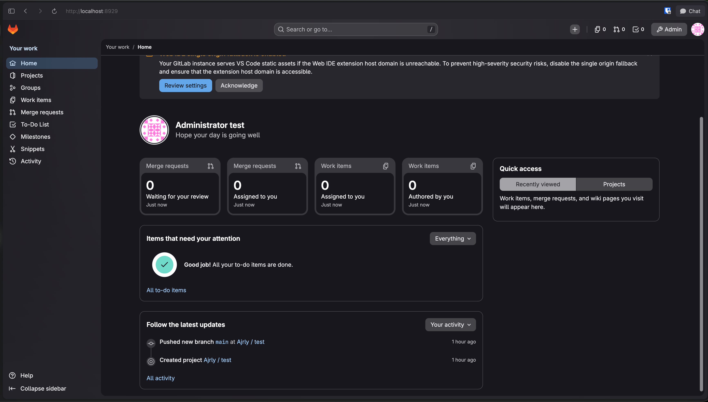

# GitLab CE — Docker Compose

A production-grade, **fully self-provisioning** [GitLab Community Edition](https://about.gitlab.com/install/)
deployment using Docker Compose. One `docker compose up` gives you a complete,
ready-to-use GitLab with the Container Registry enabled, **MinIO object storage**
for all large blobs, a fleet of 5 CI/CD runners **auto-registered**, and a
shared S3 cache — **no manual steps**.

> **Zero-touch:** drop the whole stack (`make destroy`) and bring it back up
> (`make up`) and it comes back fully configured. You just log in to the
> dashboard and start working — no registering runners, no creating buckets.



## Contents

| File                           | Purpose                                                     |
| ------------------------------ | ----------------------------------------------------------- |
| `docker-compose.yml`           | All service definitions (healthchecks, limits, tuning)      |
| `.env` / `.env.example`        | Every configurable setting (ports, URL, resources, secrets) |
| `Makefile`                     | Convenience commands (`make up`, `make runners-list`, …)    |
| `scripts/bootstrap-runners.sh` | Idempotent runner auto-provisioner                          |
| `scripts/register-runner.sh`   | Register one runner container                               |
| `scripts/unregister-runner.sh` | Remove runners from GitLab                                  |
| `scripts/minio-setup.sh`       | Idempotent MinIO bucket provisioner                         |
| `examples/.gitlab-ci.yml`      | Monorepo-tuned pipeline example                             |

The stack runs these services on the `gitlab-ce-net` network:

| Service                 | Container(s)                              | Purpose                                                                   |
| ----------------------- | ----------------------------------------- | ------------------------------------------------------------------------- |
| `gitlab`                | `gitlab-ce`                               | GitLab CE + bundled **PostgreSQL, Redis** + **Container Registry** (5050) |
| `gitlab-runner` … `-04` | `gitlab-runner`, `gitlab-runner-01`…`-04` | **Fleet of 5** CI/CD runners (Docker executor + dind)                     |
| `minio`                 | `gitlab-minio`                            | **S3 object storage** — GitLab blobs + runner cache                       |
| `minio-setup`           | `gitlab-minio-setup`                      | One-shot: creates all MinIO buckets, then exits                           |
| `runner-bootstrap`      | `gitlab-runner-bootstrap`                 | One-shot: **auto-registers the runner fleet**, then exits                 |

State (GitLab config, logs, data, each runner's config, cache) is persisted in
**named Docker volumes** rather than host bind mounts — see
[Why named volumes](#why-named-volumes).

## What gets provisioned automatically

On first `up`, with **no human action**:

1. GitLab CE boots and reconfigures itself (PostgreSQL, Redis, Nginx, Gitaly…).
2. The **Container Registry** is enabled on port `5050` (image layers in MinIO).
3. **MinIO** starts and `minio-setup` creates all buckets (artifacts, LFS,
   uploads, packages, registry, runner cache, …).
4. `runner-bootstrap` waits for GitLab's API to be ready, mints a runner
   authentication token for each of the 5 runners, and registers them with the
   Docker executor + shared cache. It is **idempotent** — re-running `up` never
   creates duplicates.

Then you just open the dashboard and use it.

## Requirements

- Docker Engine 20.10+ and Docker Compose v2+
- **Minimum:** 4 vCPU / 4 GB RAM — **Recommended:** 4+ vCPU / 8 GB RAM
- ~10 GB free disk to start (grows with repositories, CI artifacts, backups)

## Quick start

```bash
# 1. Configure (edit URL, ports, password, resources) - or keep the defaults
cp .env.example .env
$EDITOR .env

# 2. (optional) Validate the config
make config          # or: docker compose config

# 3. Launch EVERYTHING (GitLab + registry + 5 runners + cache)
make up              # or: docker compose up -d

# 4. Watch it come up (first boot takes ~4–8 minutes: reconfigure + migrations)
make health          # prints: starting → healthy
make bootstrap-logs  # follow the auto-provisioner registering the 5 runners
```

That's it. When health is **healthy** and the bootstrap logs say
`Runner provisioning complete`, open the URL from `GITLAB_EXTERNAL_URL`
(default <http://localhost:8929>) and log in. The 5 runners are already active
under **Admin → CI/CD → Runners**.

> **First boot timing:** the container becomes `healthy` before the web API is
> fully serving. The `runner-bootstrap` service handles this for you — it waits
> for the API, then registers the fleet. You don't need to time anything.

### First login

- **Username:** `root`
- **Password:** the value of `GITLAB_ROOT_PASSWORD` in `.env`.
  If you left it blank, GitLab generated one — read it with:

  ```bash
  make password    # docker compose exec gitlab cat /etc/gitlab/initial_root_password
  ```

  > That file is auto-deleted 24 hours after the first boot, so log in and
  > change the password promptly.

## Architecture & data storage

### What GitLab uses internally

GitLab is not "just a web app" — it depends on several backend services. In this
stack they all run **inside the `gitlab-ce` Omnibus container**, managed by
`gitlab-ctl` / `runit`:

| Component                    | Role                                                                  | Bundled in this stack?  | Data location (`gitlab-ce-data` volume) |
| ---------------------------- | --------------------------------------------------------------------- | ----------------------- | --------------------------------------- |
| **PostgreSQL**               | Primary database (users, projects, issues, CI metadata, permissions…) | ✅ Yes                  | `/var/opt/gitlab/postgresql/data`       |
| **Redis**                    | Cache, job queues (Sidekiq), sessions, rate limiting, ActionCable     | ✅ Yes                  | `/var/opt/gitlab/redis`                 |
| **Gitaly**                   | Git RPC — clone, push, fetch, repo storage                            | ✅ Yes                  | `/var/opt/gitlab/git-data/repositories` |
| **Puma**                     | Rails web application server                                          | ✅ Yes                  | —                                       |
| **Sidekiq**                  | Background jobs (CI scheduling, emails, webhooks…)                    | ✅ Yes                  | —                                       |
| **Workhorse + Nginx**        | Reverse proxy, Git HTTP, large uploads                                | ✅ Yes                  | —                                       |
| **Container Registry**       | Docker/OCI image storage (layers in MinIO)                            | ✅ Yes (enabled)        | MinIO bucket `gitlab-registry`          |
| **Object storage**           | CI artifacts, LFS, uploads, packages (large blobs)                    | ✅ **MinIO** (external) | MinIO buckets (see below)               |
| **MinIO** (separate service) | S3-compatible store for GitLab blobs **and** runner cache             | Separate container      | `gitlab-ce-minio-data` volume           |

Inspect the bundled datastores:

```bash
make db-status       # gitlab-ctl status postgresql redis
make psql            # open a psql shell (gitlab-psql) to the GitLab database
```

Inside the container you can also run:

```bash
docker exec gitlab-ce gitlab-rails runner 'c=ActiveRecord::Base.connection; puts "adapter=#{c.adapter_name}"'
docker exec gitlab-ce gitlab-ctl status          # all Omnibus services
```

### Bundled vs external services — best practice

**Default rule:** for a **single-node** GitLab (dev, staging, or a small/medium
team on one host), **keep PostgreSQL and Redis bundled**. That is GitLab's
officially recommended Omnibus layout. The image ships version-matched
PostgreSQL and Redis, applies the right tuning, runs migrations, and integrates
backups — you do not run separate `postgres` or `redis` containers unless you
have a concrete scaling or HA requirement.

| Scenario                                                     | PostgreSQL                        | Redis                                                  | Object storage         | Gitaly             |
| ------------------------------------------------------------ | --------------------------------- | ------------------------------------------------------ | ---------------------- | ------------------ |
| **This stack** — single node, dev/staging, large monorepo CI | **Bundled** ✅                    | **Bundled** ✅                                         | **MinIO** ✅ (enabled) | **Bundled** ✅     |
| Production, moderate, still 1 node, ≲500 users               | Bundled                           | Bundled                                                | MinIO / S3             | Bundled            |
| HA / large (GitLab Reference Architectures, 2k+ users)       | **External** (managed or Patroni) | **External** (Sentinel / managed, often split by role) | External               | **Gitaly Cluster** |

**This repository intentionally uses bundled PostgreSQL and Redis.** Adding them
as separate Compose services would:

- require you to match GitLab's exact PostgreSQL version and extensions,
- duplicate tuning GitLab Omnibus already applies,
- add backup/upgrade/migration work you do not need on a single host, and
- increase fragility without improving performance at this scale.

### When external services _do_ make sense

Consider externalizing only when you outgrow a single node:

1. **High availability** — multiple GitLab app nodes behind a load balancer; the
   database and Redis must be shared and fault-tolerant.
2. **Horizontal scaling** — GitLab [Reference Architectures](https://docs.gitlab.com/administration/reference_architectures/)
   (2k, 5k, 10k+ users) assume external PostgreSQL, split Redis, object storage,
   and often Gitaly Cluster.
3. **Managed ops** — you want RDS/Cloud SQL/ElastiCache to handle backups,
   patching, and failover instead of Omnibus.

Until then, bundled is simpler, supported, and correct.

### PostgreSQL (bundled)

- GitLab stores **all application state** in PostgreSQL: users, groups, projects,
  issues/MRs, CI pipeline metadata, permissions, settings, etc.
- Omnibus runs a real PostgreSQL server (not SQLite). Version is tied to the
  GitLab release (e.g. PostgreSQL 17.x on GitLab 19.x).
- Required extensions include `pg_trgm`, `btree_gist`, and `plpgsql` — Omnibus
  enables these automatically.
- **Backups:** use `make backup` (application backup includes the DB). Also back
  up the config volume (`gitlab-secrets.json` is critical).
- **External PostgreSQL notes** (if you migrate later): must meet GitLab's
  [requirements](https://docs.gitlab.com/install/requirements/#postgresql); Amazon
  Aurora is **not** supported for the main GitLab database; you become responsible
  for version upgrades, extensions, and `gitlab:db:configure`.

### Redis (bundled)

Redis is used for several **distinct purposes** inside GitLab:

| Redis role    | Purpose                         |
| ------------- | ------------------------------- |
| Cache         | Fragment/cache layers           |
| Queues        | Sidekiq background jobs         |
| Shared state  | Cross-process coordination      |
| Sessions      | User session data               |
| Rate limiting | API/request throttling          |
| ActionCable   | Real-time features (if enabled) |

On a single Omnibus node, **one bundled Redis instance** handles all of these.
At large scale, GitLab recommends **splitting Redis by function** and using
Sentinel or a managed service (ElastiCache, Memorystore, etc.) — that complexity
is unnecessary for this stack.

### Object storage & MinIO in this stack

Large blobs (CI artifacts, LFS objects, uploads, package registry files, registry
image layers) grow much faster than PostgreSQL data. This stack **externalizes
all of them to MinIO** — the recommended single-node optimization. PostgreSQL
and Redis stay bundled; only blobs move out, keeping the `gitlab-ce-data` volume
lean.

**MinIO is configured automatically** in `docker-compose.yml` via Omnibus
`gitlab_rails['object_store']` and `registry['storage']`. Buckets are created by
`minio-setup` before GitLab starts — no manual steps.

| Bucket                    | Purpose                                               |
| ------------------------- | ----------------------------------------------------- |
| `gitlab-artifacts`        | CI/CD job artifacts                                   |
| `gitlab-lfs`              | Git LFS objects                                       |
| `gitlab-uploads`          | Avatars, attachments, project uploads                 |
| `gitlab-packages`         | Package Registry (npm, Maven, …)                      |
| `gitlab-registry`         | Container Registry image layers                       |
| `gitlab-dependency-proxy` | Dependency Proxy cache                                |
| `gitlab-terraform-state`  | Terraform state files                                 |
| `gitlab-ci-secure-files`  | CI secure files                                       |
| `gitlab-pages`            | GitLab Pages content                                  |
| `gitlab-external-diffs`   | External merge request diffs                          |
| `runner-cache`            | GitLab Runner distributed cache (shared across fleet) |

Endpoints and credentials:

- **S3 API:** <http://localhost:9000> (internal: `http://minio:9000`)
- **Console:** <http://localhost:9001>
- **Credentials:** `MINIO_ROOT_USER` / `MINIO_ROOT_PASSWORD` in `.env`
- Bucket names are configurable via `GITLAB_OBJECT_BUCKET_*` in `.env`

Inspect object storage:

```bash
make minio-buckets          # list all buckets
make object-store-status    # show Omnibus object-store config
make minio-provision        # (re)create buckets idempotently
```

> **Migrating from local disk:** if you already have blobs on the GitLab data
> volume from before object storage was enabled, they stay on disk until you run
> GitLab's [object storage migration](https://docs.gitlab.com/administration/object_storage/#migrating-to-object-storage).
> Fresh installs (`make destroy` + `make up`) store everything in MinIO from
> day one.

### Gitaly & Git storage

Git repositories live on disk via **Gitaly**, also bundled. For multi-node or
very large repo counts, GitLab offers **Gitaly Cluster** ( Praefect + multiple
Gitaly nodes). Not needed for a single Docker host.

### Decision summary for this repository

| Question                                  | Answer for this stack                                                      |
| ----------------------------------------- | -------------------------------------------------------------------------- |
| Do we need a separate `postgres` service? | **No** — bundled PostgreSQL is correct                                     |
| Do we need a separate `redis` service?    | **No** — bundled Redis is correct                                          |
| Is the Container Registry enabled?        | **Yes** — port `5050`, layers stored in MinIO `gitlab-registry` bucket     |
| Is MinIO used for GitLab's DB?            | **No** — PostgreSQL is bundled; MinIO stores **blobs** (artifacts, LFS…)   |
| Where do CI artifacts / LFS / uploads go? | **MinIO** — auto-configured, buckets auto-created                          |
| What if I `make destroy` and `make up`?   | Everything reprovisions; blobs in `gitlab-ce-minio-data`, DB in GitLab vol |

### Upgrade path (when you outgrow single-node)

If you move to production HA or cloud, typical order of externalization:

1. ~~**Object storage** (MinIO/S3)~~ — **already done** in this stack.
2. **Managed PostgreSQL** — RDS, Cloud SQL, or self-hosted Patroni cluster.
3. **Managed / split Redis** — Sentinel or cloud Redis with separate instances per
   GitLab Redis role.
4. **Gitaly Cluster** — when repo storage or Git RPC becomes the bottleneck.

Each step is documented in GitLab's
[Reference Architectures](https://docs.gitlab.com/administration/reference_architectures/)
and [Omnibus external services](https://docs.gitlab.com/omnibus/settings/database.html)
guides. Object storage is already externalized; PostgreSQL/Redis externalization
is the next step when you need HA.

## Configuration

Everything is driven by `.env`. The most common settings:

| Variable                         | Default                 | Notes                                                   |
| -------------------------------- | ----------------------- | ------------------------------------------------------- |
| `GITLAB_VERSION`                 | `latest`                | Pin to a version (e.g. `17.10.0-ce.0`) for production   |
| `GITLAB_EXTERNAL_URL`            | `http://localhost:8929` | Scheme + host + port users browse to                    |
| `GITLAB_HTTP_PORT`               | `8929`                  | Host HTTP port (matches the URL port)                   |
| `GITLAB_HTTPS_PORT`              | `8443`                  | Host HTTPS port                                         |
| `GITLAB_SSH_PORT`                | `2224`                  | Host port for Git-over-SSH                              |
| `GITLAB_ROOT_PASSWORD`           | —                       | Initial `root` password (min 8 chars)                   |
| `GITLAB_MEM_LIMIT`               | `8g`                    | Hard memory ceiling for the container                   |
| `GITLAB_PUMA_WORKERS`            | `2`                     | Web workers; raise for more concurrent users            |
| `GITLAB_REGISTRY_PORT`           | `5050`                  | Host/registry port (plain HTTP)                         |
| `RUNNER_CONCURRENT`              | `4`                     | Parallel jobs **per runner** (×5 runners for the fleet) |
| `RUNNER_TAGS`                    | `docker,monorepo`       | Tags applied to every runner                            |
| `RUNNER_DEFAULT_IMAGE`           | `docker:27-cli`         | Default job image                                       |
| `MINIO_ROOT_USER` / `_PASSWORD`  | `gitlab-minio` / …      | MinIO credentials (GitLab blobs + runner cache)         |
| `GITLAB_OBJECT_BUCKET_ARTIFACTS` | `gitlab-artifacts`      | CI artifacts bucket                                     |
| `GITLAB_OBJECT_BUCKET_REGISTRY`  | `gitlab-registry`       | Container Registry layers bucket                        |
| `RUNNER_CACHE_BUCKET`            | `runner-cache`          | Runner distributed cache bucket                         |

Advanced Omnibus settings live inline in `docker-compose.yml` under
`GITLAB_OMNIBUS_CONFIG`. After changing them:

```bash
make up            # recreate with the new environment
# or, to apply without recreating:
make reconfigure
```

### Git over SSH

The container's SSH (port 22) is published on `GITLAB_SSH_PORT` (default 2224).
Clone URLs will therefore include the port:

```bash
git clone ssh://git@localhost:2224/your-group/your-project.git
```

## CI/CD: Runners, Registry & Cache

This stack ships a ready-to-use CI/CD setup optimized for a **large monorepo**:
a **fleet of 5 auto-registered Docker-executor runners**, the built-in Container
Registry, and a shared MinIO (S3) cache.

### The runner fleet (auto-registered)

Five runner containers are defined and registered automatically on `up`:

```
gitlab-runner   gitlab-runner-01   gitlab-runner-02   gitlab-runner-03   gitlab-runner-04
```

There is **no manual registration step**. The `runner-bootstrap` service:

1. waits for GitLab's HTTP API to be ready,
2. mints a modern **authentication token** (`glrt-…`) for each runner via the
   API — GitLab 18+ removed the legacy `registration_token` flow, so this is the
   supported approach,
3. registers each runner (Docker executor + shared cache),
4. is **idempotent**: already-registered runners are skipped, so re-running
   `make up` or `make runners-provision` never creates duplicates.

Because all runners enable `run_untagged`, they immediately pick up jobs with no
tags — which is exactly what fixes:

> _"This job is stuck because you don't have any active runners that can run this job."_

Manage the fleet:

```bash
make runners-list          # list runners in every container
make runners-verify        # confirm GitLab sees them online
make runners-logs          # follow logs from all 5 runners
make runners-provision     # (re)provision - idempotent, safe anytime
make bootstrap-logs        # view the auto-provisioner's output
make runners-unregister    # remove the whole fleet from GitLab
```

### Add or remove runners later (without breaking anything)

**Add a brand-new runner** (e.g. a 6th):

1. In `docker-compose.yml`, copy a runner block to a new service
   `gitlab-runner-05` (give it `container_name`, `hostname`, and a new
   `gitlab-runner-config-05` volume), and add that volume under `volumes:`.
2. Bring it up and register just that one — idempotent, touches nothing else:

   ```bash
   docker compose up -d gitlab-runner-05
   make runner-add NAME=gitlab-runner-05
   ```

To include it in the auto-provisioner for future resets, also add its name to
`RUNNER_CONTAINERS` in the `runner-bootstrap` service.

**Remove a runner:** `./scripts/unregister-runner.sh gitlab-runner-05`, then
delete its service/volume from `docker-compose.yml`.

**More parallelism without more containers:** raise `RUNNER_CONCURRENT` in
`.env` and `make runners-provision` (or `make up`). Total parallel jobs ≈
`5 × RUNNER_CONCURRENT`.

### How each runner is configured

- **Executor:** `docker`, spawning sibling job containers via the host Docker
  socket, attached to `gitlab-ce-net` so jobs resolve `gitlab`, `gitlab.local`
  and `minio`.
- **Privileged + `/certs/client`:** lets pipelines use `docker:dind` to build
  and push images.
- **`concurrent = RUNNER_CONCURRENT`** per container.
- **`clone_url = http://gitlab:8929`:** jobs clone over the internal network
  regardless of the browser-facing URL.
- **Shared S3 cache** on MinIO (`runner-cache` bucket), so all 5 runners share
  one cache.

### Container Registry

The registry is enabled on **port 5050** over plain HTTP and advertised as
`gitlab.local:5050`.

**Make `gitlab.local` resolvable on your host** (one-time, needed for browser
links and `docker login` from the host — CI jobs already resolve it via the
Docker network):

```bash
echo "127.0.0.1 gitlab.local" | sudo tee -a /etc/hosts
```

**Trust the insecure (HTTP) registry** so your host Docker can push/pull.
In Docker Desktop → _Settings → Docker Engine_, add:

```json
{ "insecure-registries": ["gitlab.local:5050"] }
```

Then, from the host:

```bash
docker login gitlab.local:5050 -u root -p '<your-root-password>'
```

Check the endpoint any time:

```bash
make registry-status         # HTTP 401 = up (registry requires auth)
```

Inside CI, the standard variables just work:

```yaml
script:
  - echo "$CI_REGISTRY_PASSWORD" | docker login -u "$CI_REGISTRY_USER" --password-stdin "$CI_REGISTRY"
  - docker build -t "$CI_REGISTRY_IMAGE:$CI_COMMIT_SHORT_SHA" .
  - docker push "$CI_REGISTRY_IMAGE:$CI_COMMIT_SHORT_SHA"
```

> Because the registry is HTTP, the `docker:dind` service must trust it:
>
> ```yaml
> services:
>   - name: docker:27-dind
>     command: ["--insecure-registry=gitlab.local:5050"]
> ```

### MinIO (object storage + runner cache)

MinIO stores **all GitLab large blobs** (artifacts, LFS, uploads, packages,
registry layers) and the **runner distributed cache**. Everything is
auto-provisioned — buckets are created by `minio-setup` on every `up`.

- S3 API: <http://localhost:9000> • Console: <http://localhost:9001>
- Credentials: `MINIO_ROOT_USER` / `MINIO_ROOT_PASSWORD` in `.env`
- See [Object storage & MinIO](#object-storage--minio-in-this-stack) for the full bucket list

```bash
make minio-buckets       # list buckets
make object-store-status # verify GitLab Omnibus config
```

### Monorepo pipeline tips

See [`examples/.gitlab-ci.yml`](examples/.gitlab-ci.yml) for a working example.
Key techniques for large monorepos:

- **Only build what changed** with `rules: changes:` per component/service.
- **Shallow, fast checkout:** `GIT_DEPTH`, `GIT_STRATEGY: fetch`, `FF_USE_FASTZIP`.
- **Per-component cache keys** (`cache:key:files`) for high cache-hit rates.
- **`needs:`** to build a DAG so independent components run in parallel.
- Scale throughput by raising `RUNNER_CONCURRENT` and/or adding runner
  containers (see [Add or remove runners later](#add-or-remove-runners-later-without-breaking-anything)).

## Day-2 operations

```bash
make status        # container + health status
make check         # GitLab's built-in self-diagnostics (gitlab:check)
make backup        # application backup (make backup-pull to copy it out)
make upgrade       # pull newest image + recreate (see upgrade note below)
make down          # stop (data preserved in volumes)
make destroy       # DANGER: stop + delete ALL persisted volumes
```

### Reset / re-provision (zero-touch)

The whole stack is designed to be disposable and self-provisioning:

```bash
make destroy       # remove containers + ALL volumes (full wipe)
make up            # fresh install: GitLab + registry + 5 runners + cache
```

After `make up`, wait for `make health` = `healthy` and
`make bootstrap-logs` = `Runner provisioning complete`. Everything is
re-created automatically — you never re-register runners or re-create the cache
bucket by hand.

If you only `make down` (volumes kept) and `make up` again, the runners are
already registered; the bootstrap simply confirms and skips them.

### Why named volumes

The GitLab Omnibus image enforces strict filesystem ownership during
`reconfigure` (for example `/var/opt/gitlab/git-data/repositories` **must** be
owned by `git:git`). Docker Desktop **bind mounts on macOS/Windows cannot honor
those uid/gid ownerships**, so reconfigure fails with:

```
Failed asserting that ownership of "/var/opt/gitlab/git-data/repositories" was git:git
```

Named volumes live on the Docker VM's native Linux filesystem, where ownership
is preserved correctly, so GitLab boots cleanly. This is the recommended way to
run GitLab in Docker on a Mac/Windows host.

### Backups

`make backup` creates a tarball inside the data volume
(`/var/opt/gitlab/backups`). Copy it to the host with:

```bash
make backup-pull    # -> ./backups/
```

Note that GitLab's application backup does **not** include the
configuration/secrets — also back up the config volume (especially
`gitlab-secrets.json` and `gitlab.rb`):

```bash
docker cp gitlab-ce:/etc/gitlab ./backups/config
```

### Upgrades

GitLab must be upgraded through supported version paths — do **not** skip major
versions. When jumping several releases, pin `GITLAB_VERSION` to each required
stop on the [upgrade path](https://docs.gitlab.com/ee/update/#upgrade-paths),
running `make upgrade` at each step and waiting for `healthy` before continuing.

## Resource tuning

This setup is tuned for a small/medium instance:

- Bundled Prometheus/Grafana monitoring is **disabled** to save ~500 MB RAM.
- Puma workers, Sidekiq concurrency and PostgreSQL `shared_buffers` are
  configurable via `.env`.
- `shm_size` is raised to 256 MB (PostgreSQL needs more than Docker's 64 MB
  default).

On a constrained host, lower `GITLAB_PUMA_WORKERS=1`,
`GITLAB_SIDEKIQ_CONCURRENCY=5`, `GITLAB_MEM_LIMIT=4g`. On a busy instance, raise
workers and memory.

## Troubleshooting

- **Stuck in `starting`/`unhealthy` for a while:** normal on first boot; the
  reconfigure step can take several minutes. Follow `make logs`.
- **`could not resize shared memory` in PostgreSQL logs:** ensure `shm_size` is
  set (it is here) and the host allows it.
- **502 in the browser right after start:** GitLab is still booting; wait for
  the healthcheck to report `healthy`.
- **Port already in use:** change `GITLAB_HTTP_PORT` / `GITLAB_SSH_PORT` /
  `GITLAB_REGISTRY_PORT` / `MINIO_PORT` in `.env`.
- **Runners log `config.toml: no such file or directory` on first boot:** this was
  a harmless race — runners started before `runner-bootstrap` created their config.
  Fixed by `scripts/runner-entrypoint.sh`, which waits for bootstrap then starts.
  After `make up`, you should only see `[runner-entrypoint] waiting for
runner-bootstrap…` followed by `config ready, starting gitlab-runner`. If it
  persists past ~10 minutes, check `make bootstrap-logs`.
- **Runners didn't register / job still stuck:** the auto-provisioner waits for
  the API, but if it exited early (`make bootstrap-logs` shows an error), just
  re-run it — it's idempotent:

  ```bash
  make runners-provision
  make runners-verify
  ```

- **`docker login`/push fails from the host:** you skipped the `/etc/hosts`
  entry or the insecure-registry setting (see [Container Registry](#container-registry)).
  CI jobs are unaffected — they resolve `gitlab.local` on the Docker network.

## References

- GitLab Docker install: <https://docs.gitlab.com/ee/install/docker/>
- Omnibus configuration: <https://docs.gitlab.com/omnibus/settings/>
- System requirements (PostgreSQL, Redis): <https://docs.gitlab.com/ee/install/requirements.html>
- External PostgreSQL: <https://docs.gitlab.com/omnibus/settings/database.html>
- External Redis: <https://docs.gitlab.com/omnibus/settings/redis.html>
- Object storage: <https://docs.gitlab.com/administration/object_storage/>
- Reference Architectures (scaling): <https://docs.gitlab.com/administration/reference_architectures/>
